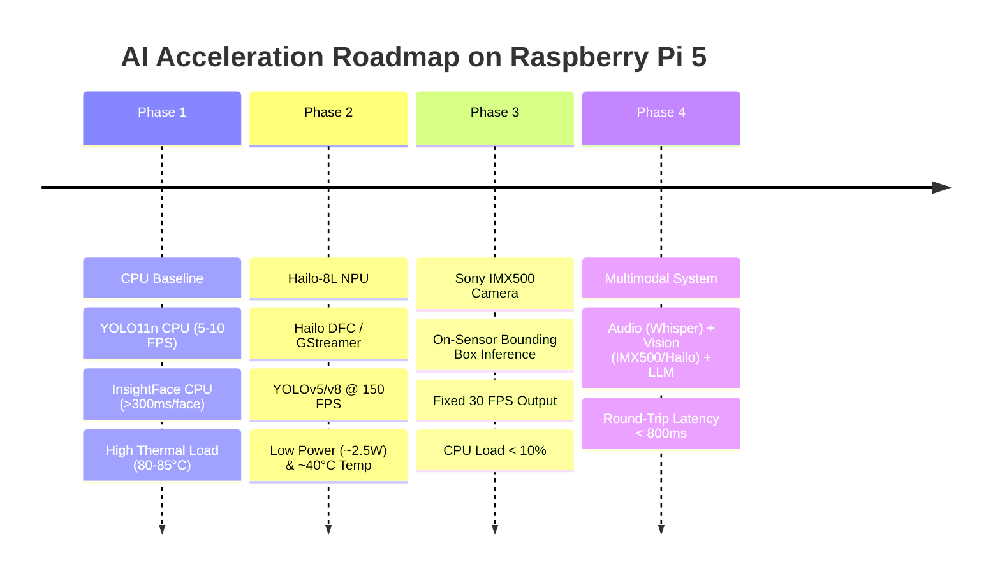

# AI Optimization & Roadmap Comparative Study on Raspberry Pi 5

This document outlines a 4-phase Spec-Driven Development roadmap to systematically evaluate performance gains between software CPU execution and hardware acceleration (Hailo-8L NPU & Sony IMX500 AI Camera).

---

## 1. Comparative Development Roadmap

---

## 2. Phase Breakdown

### Phase 1: CPU Baseline (Unaccelerated Reference)
- **Object Detection**: `YOLOv11n` or `YOLO26n` on CPU via `ultralytics` or OpenCV DNN.
  - *Expected Metrics*: 5–10 FPS.
- **Face Recognition**: InsightFace CPU embedding extraction.
  - *Expected Metrics*: High latency (> 300-500 ms per detected face).
- **Thermal Behavior**: High RAM usage and rapid thermal throttling (80–85°C) without active cooling.

### Phase 2: NPU Acceleration (Hailo-8L AI HAT+)
- **Software Flow**: Use `hailo-apps` and GStreamer pipelines.
- **Model Conversion**: Compile `.onnx` models to INT8 `.hef` format via Hailo Dataflow Compiler (DFC).
- **Expected Metrics**: Object detection throughput jumps to **55–150 FPS**. CPU load stays under 20%, keeping temperature at ~40–45°C.

### Phase 3: Smart AI Camera (Sony IMX500 On-Sensor)
- **Configuration**: Deploy custom neural network models directly to the camera's 8 MB embedded SRAM.
- **Inference**: On-sensor object/face bounding box detection.
- **Expected Metrics**: **Stable 30 FPS**. CPU consumption for detection drops to < 10%, leaving max CPU power for voice/LLM engines.

### Phase 4: Multimodal Orchestration
- Integrate vision (IMX500/Hailo) with offline Speech Recognition (Faster-Whisper), Text-to-Speech (Piper), and LLM (llama.cpp/ollama).
- Achieve end-to-end user interaction latency between **500 ms and 800 ms**.

---

## 3. Benchmark Synthesis Table

| Metric | Phase 1: CPU Only | Phase 2: Hailo-8L NPU | Phase 3: Sony IMX500 AI Camera |
|---|---|---|---|
| **Object Detection FPS** | 5 – 10 FPS | **55+ FPS** | **30 FPS (Fixed)** |
| **Face Recognition Latency** | > 500 ms | < 350 ms | Hybrid (Offloaded Detection + Host ArcFace) |
| **CPU Utilization** | 90% – 100% | ~30% – 40% | **< 10% (Vision)** |
| **Stable Operating Temp** | 80°C – 85°C (Throttling risk) | ~40°C – 50°C | ~40°C |
| **Power Draw** | High | ~2.5W NPU | Minimal (Camera board) |
| **Cloud Dependency** | 100% Offline | 100% Offline | 100% Offline |
