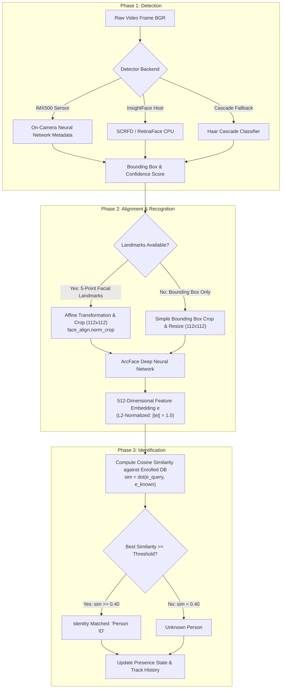

# Vision Architecture, Technical Choices, & Implementation Guide

This document outlines the computer vision architecture, hardware choices, SOTA benchmarks for Raspberry Pi 5, and the codebase implementation under `src/vision/`.

---

## 1. Executive Summary & Hardware Strategy

Computer vision on edge hardware like the **Raspberry Pi 5** (Broadcom BCM2712, 4x Cortex-A76 @ 2.4GHz) faces a fundamental trade-off between inference speed (FPS) and recognition accuracy. A pure CPU approach using standard PyTorch models is too heavy for real-time video processing.

To achieve real-time performance fully offline, four hardware tiers are supported:

| Hardware Tier | Detection Stack | Recognition Stack | Target FPS (RPi5) | Accuracy | Primary Use Case |
|---|---|---|---|---|---|
| **Level 1: CPU Classic** | OpenCV Haar Cascade | LBPH / Fisherfaces | 5–8 FPS | ~75% | CPU fallback / Educational PoC |
| **Level 2: CPU NCNN / ONNX** | MobileNetV2 / YOLOv8n (ncnn/ONNX) | ArcFace (INT8 CPU) | 12–20 FPS | ~92% | Budget deployment (No extra hardware) |
| **Level 3: Split Hybrid (IMX500)** | Sony IMX500 AI Camera (On-sensor MobileNet/YOLO) | InsightFace `buffalo_l` (ArcFace CPU) | 30 FPS sensor / 15-25 FPS recognition | ~95%+ | Offloads detection to sensor chip |
| **Level 4: AI HAT+ (Hailo-8L)** | YOLOv5-personface / YOLOv8 (Hailo NPU @ PCIe 3.0) | ArcFace / InsightFace (NPU/CPU) | **127–150 FPS** | ~95–99% | Maximum speed & SOTA multi-person tracking |

### Recommended Hardware Path

For optimal balance of cost, power, and performance on Raspberry Pi 5:
- **Primary Option (Split Hybrid)**: **Raspberry Pi AI Camera (Sony IMX500)** for on-sensor face detection + Host CPU for InsightFace ArcFace embedding extraction.
- **High-Performance Option**: **Raspberry Pi AI HAT+ (Hailo-8L NPU)** via PCIe 3.0 for ultra-high FPS object and face detection.

---

## 2. The 3-Phase Vision Pipeline

Face recognition is divided into three distinct algorithmic phases: **Detection**, **Alignment & Recognition (Embedding Extraction)**, and **Identification (Database Matching)**.



---

### Phase Details

#### Phase 1: Detection
- **Input**: BGR Image Frame (e.g. $640 \times 640$ or $1280 \times 720$).
- **Goal**: Locate faces in the image and output bounding box coordinates $[x_1, y_1, x_2, y_2]$, confidence scores, and optional 5-point facial landmarks (left eye, right eye, nose tip, left mouth corner, right mouth corner).
- **Implementation**:
  - `Imx500Detector`: Fetches metadata bounding boxes directly from the Sony IMX500 sensor hardware.
  - `InsightFaceDetector`: Uses SCRFD-10GF via ONNX Runtime on the host CPU.

#### Phase 2: Alignment & Recognition (Embedding)
- **Input**: BGR Image Frame + Bounding Box + 5-Point Landmarks.
- **Goal**: Standardize facial orientation and generate a compact, discriminative 512-dimensional vector representation ($\mathbf{e} \in \mathbb{R}^{512}$).
- **Alignment**:
  - If 5 landmarks are available, an affine transformation (`insightface.utils.face_align.norm_crop`) aligns the eyes horizontally and scales the face into a canonical $112 \times 112$ patch.
  - If landmarks are missing, the bounding box is cropped directly and resized to $112 \times 112$.
- **Feature Extraction**:
  - Passed through the ArcFace ResNet50 model (`buffalo_l`).
  - The resulting raw embedding is $L_2$-normalized: $\mathbf{e} = \frac{\mathbf{e}_{raw}}{\|\mathbf{e}_{raw}\|_2}$.

#### Phase 3: Identification & Matching
- **Input**: Normalized query embedding $\mathbf{e}_{query}$ and enrolled database embeddings $\{\mathbf{e}_k\}_{k=1}^N$.
- **Goal**: Find the closest enrolled identity.
- **Cosine Distance Scoring**:
  $$\text{Similarity}(\mathbf{e}_{query}, \mathbf{e}_{known}) = \mathbf{e}_{query} \cdot \mathbf{e}_{known}$$
- **Decision Thresholding**:
  - Default threshold $\tau = 0.40$.
  - If $\max_k (\mathbf{e}_{query} \cdot \mathbf{e}_k) \ge \tau$, output identity $k$.
  - Otherwise, label as `Unknown`.

---

## 3. Codebase Architecture (`src/vision/`)

The repository organizes computer vision modules under `src/vision/` using standard object-oriented abstraction layers.

```
src/vision/
├── __init__.py
├── base.py                   # Base interfaces: BaseDetector, DetectionDict
├── face_detector.py          # InsightFaceDetector (CPU/SCRFD) & Imx500Detector (IMX500 RPK)
├── face_detector_cascade.py  # Haar Cascade CPU fallback detector
├── face_recognizer.py        # ArcFaceRecognizer (alignment, 512d embeddings, cosine similarity)
├── face_insight_pipeline.py  # FaceInsightPipeline (Unified detector + recognizer orchestrator)
├── face_in_frame.py          # High-level presence tracking manager
├── object_insight_frame.py   # High-level object tracking manager
├── video_capture.py          # Multi-threaded Picamera2 / OpenCV video capture stream
├── yolo_cpu.py               # CPU & NCNN object detection
└── yolo_imx500.py            # Sony IMX500 object detection wrapper
```

### Module Responsibilities

#### 1. `src/vision/base.py`
Defines the `BaseDetector` abstract class and `DetectionDict` type definition:
```python
class DetectionDict(TypedDict):
    box: list[int]  # [x1, y1, x2, y2]
    score: float
    class_id: int
    label: str
```

#### 2. `src/vision/face_detector.py`
Provides face detection wrappers:
- `DetectedFace`: Data structure containing `bbox`, `landmark5`, `score`, `identity`, `similarity`, and `embedding`.
- `InsightFaceDetector`: Loads RetinaFace / SCRFD models from `buffalo_l` pack via ONNX Runtime.
- `Imx500Detector`: Interfaces with Raspberry Pi's `picamera2.devices.IMX500` hardware API to parse on-camera neural network metadata.

#### 3. `src/vision/face_recognizer.py`
Contains `ArcFaceRecognizer`:
- `extract_embedding(frame_bgr, bbox, landmark5)`: Performs 5-point facial alignment (`face_align.norm_crop`) and extracts $L_2$-normalized 512-d embeddings using ArcFace.
- `register_face(face_id, img_bgr)`: Enrolls a new identity embedding into the active in-memory / SQLite dictionary.
- `match_face(emb, thresh)`: Computes dot-product cosine similarity against registered faces.

#### 4. `src/vision/face_insight_pipeline.py`
Implements `FaceInsightPipeline` (inherits `BaseDetector`):
- Unifies detection and recognition into a single plug-and-play object.
- Dynamically initializes either `InsightFaceDetector` or `Imx500Detector` based on configuration (`config.vision.face_detector_type`).
- Manages embedding extraction and identity matching.

#### 5. `src/vision/face_in_frame.py`
High-level state manager for checking whether a targeted person is present in the current camera frame, maintaining temporal tracking smoothing.

---

## 4. Model Setup & Offline Preparation

### Preloading InsightFace Models (`buffalo_l`)

InsightFace automatically stores downloaded model weights in `~/.insightface/models/`. For offline operation on Raspberry Pi 5, pre-download the model bundle online:

```bash
# Extract buffalo_l model files to local directory
mkdir -p ~/.insightface/models/buffalo_l
# Expected files inside buffalo_l:
# - 1k3d68.onnx
# - 2d106det.onnx
# - det_10g.onnx (SCRFD detector)
# - genderage.onnx
# - w600k_r50.onnx (ArcFace ResNet50 recognizer)
```

### Training & Exporting Custom YOLO Face Detectors for Sony IMX500

To run custom face detection on the IMX500 AI Camera sensor:

1. **Dataset**: Train on **WIDER FACE** formatted as single-class YOLO bounding boxes (`class_id: 0`, `label: face`).
2. **Training (Apple Silicon MPS / CUDA)**:
   ```python
   from ultralytics import YOLO

   model = YOLO("yolo11n.pt")
   model.train(data="face.yaml", imgsz=640, epochs=80, device="mps")
   ```
3. **IMX Quantization & Export**:
   Export using Ultralytics IMX exporter with a small validation calibration subset (64–128 image pairs to avoid OOM during quantization):
   ```python
   model.export(format="imx", data="face.yaml", imgsz=320)
   ```
4. **Package RPK for Raspberry Pi**:
   ```bash
   imx500-package -i packerOut.zip -o rpk_output
   # Produces network.rpk for Picamera2 deployment
   ```

---

## 5. Configuration Options

Vision settings are managed centrally via `src/utils/config.py` under the `vision` section:

```yaml
vision:
  face_detector_type: "insightface" # Options: "insightface", "imx500", "cascade"
  face_detector_model_path: "~/.insightface/models/buffalo_l"
  face_recognition_threshold: 0.40
  post_processing_enabled: true
  post_processing_model_full_path: "~/.insightface/models/buffalo_l/w600k_r50.onnx"
  model_resolutions:
    imx500:
      width: 640
      height: 480
```
